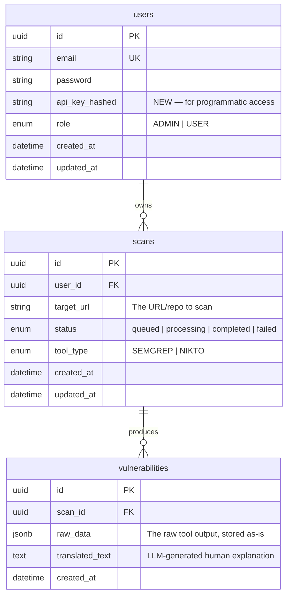
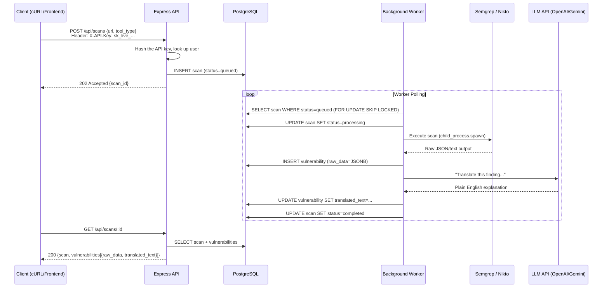

# SecureScope — "SOAR Lite" Translator: Deep Understanding

## 1. The Big Idea — What You're Actually Building

**SOAR** stands for **Security Orchestration, Automation, and Response**. Enterprise SOAR platforms (like Splunk SOAR, Palo Alto XSOAR) cost a fortune and do three things:

1. **Orchestrate** — connect to many security tools and coordinate them
2. **Automate** — run scans/checks without human intervention
3. **Respond** — take action or alert based on findings

Your **"SOAR Lite"** strips this down to the essential, learnable core:

> **A user submits a URL → the system queues a scan → runs a real security tool (Semgrep or Nikto) → stores the raw output → feeds it to an LLM → returns a human-readable vulnerability report.**

The word **"Translator"** is the killer feature here. Raw Semgrep/Nikto output is cryptic JSON/text that only security engineers can read. Your LLM layer *translates* that into plain English explanations. That's the value proposition — **democratizing security scan results**.

---

## 2. The Three Tables — What Each One Really Does

Here's your blueprint schema and what each table represents in the lifecycle:



### `users` — The Identity Layer

- Stores who is using the platform.
- `api_key_hashed`: This is a **paradigm shift** from your current JWT-cookie auth. Instead of users logging in through a browser, they authenticate via an **API key** sent in headers (like `X-API-Key: sk_live_abc123...`). The key itself is hashed before storage (just like a password) so even if the DB is compromised, the raw keys are unrecoverable.
- **Why API keys instead of JWT?** Because SecureScope is a **tool/platform**, not a social app. Users will call it programmatically (via cURL, Postman, CI/CD pipelines, scripts). API keys are the standard auth pattern for this — think GitHub API tokens, Stripe keys, OpenAI keys.

### `scans` — The Job Queue

- This is the **command center**. Each row represents a single scan job.
- `target_url`: What to scan. For **Nikto**, this is a live web server URL (e.g., `https://example.com`). For **Semgrep**, this could be a GitHub repo URL or a path to source code.
- `status`: Tracks the scan lifecycle:
  ```
  queued → processing → completed
                     ↘ failed
  ```
- `tool_type`: Which scanner to run. This is critical — your backend needs to know which tool binary to invoke:
  - **Semgrep** — Static Application Security Testing (SAST). Analyzes *source code* for vulnerabilities without running it. Finds SQL injection patterns, XSS, hardcoded secrets, etc.
  - **Nikto** — Dynamic Application Security Testing (DAST). Scans a *live web server* for misconfigurations, outdated software, dangerous files, etc.

### `vulnerabilities` — The Results Warehouse

- One scan can produce **many** vulnerability findings (one-to-many relationship).
- `raw_data` (JSONB): The **exact output** from Semgrep/Nikto, stored without modification. JSONB in PostgreSQL is powerful because:
  - Semgrep outputs structured JSON (severity, rule ID, file path, line number)
  - Nikto outputs semi-structured text/XML
  - You don't need to define columns for every possible field — JSONB handles the schema variability
  - You can still query into it: `WHERE raw_data->>'severity' = 'HIGH'`
- `translated_text`: After storing the raw data, you send it to an LLM (OpenAI, Gemini, Claude, local Ollama) with a prompt like: *"Explain this vulnerability finding in plain English. What's the risk? How do I fix it?"* — The LLM's response goes here.

---

## 3. "Postgres Maximalist" — What This Architecture Means

This is the most important design decision in your blueprint. Instead of using many specialized tools, you lean **hard** on PostgreSQL to do everything:

| Concern | Traditional Approach | Postgres Maximalist |
|---|---|---|
| **Job Queue** | Redis + BullMQ | PostgreSQL row with `status` enum + `SELECT FOR UPDATE SKIP LOCKED` or `pg_notify` |
| **Unstructured Data** | MongoDB / S3 | PostgreSQL `JSONB` columns |
| **Search** | Elasticsearch | PostgreSQL Full-Text Search (`tsvector`) |
| **Real-time Updates** | WebSockets + Redis Pub/Sub | PostgreSQL `LISTEN/NOTIFY` |
| **Caching** | Redis | PostgreSQL materialized views |

### Why does this matter for you?

You already have **BullMQ + ioredis** in your `package.json`. The "Postgres Maximalist" approach means you could potentially **drop Redis entirely** and use PostgreSQL as both your database AND your job queue. Here's how the scan queue would work using just Postgres:

```
1. User POSTs /api/scans → INSERT INTO scans (status='queued')
2. A worker process polls: SELECT * FROM scans WHERE status='queued' FOR UPDATE SKIP LOCKED LIMIT 1
3. Worker updates status to 'processing', runs the tool
4. Worker stores results in vulnerabilities table
5. Worker updates scan status to 'completed'
```

> [!IMPORTANT]
> **The decision**: Do you want to go full "Postgres Maximalist" (drop Redis/BullMQ, use Postgres for queuing), or keep BullMQ+Redis for the queue while using Postgres for everything else? Both are valid. Postgres-only is simpler to deploy, BullMQ is more battle-tested for high-throughput queuing.

---

## 4. The Complete Data Flow — End to End

Here's exactly how a request flows through the entire system:



### Key Insight: The `202 Accepted` Pattern

Notice the API returns **202 Accepted** (not 200 or 201). This is because scanning takes time (seconds to minutes). The API immediately acknowledges *"yes, I've queued your job"* and gives back a `scan_id`. The client then polls `GET /api/scans/:id` to check when `status` flips to `completed`.

---

## 5. Gap Analysis — What Your Current Code Has vs. What the Blueprint Needs

| Blueprint Requirement | Current State | What Needs to Change |
|---|---|---|
| `api_key_hashed` on User | ❌ Not in schema | Add field to User model + API key generation/validation logic |
| API Key auth middleware | ❌ You have JWT cookie auth | New middleware that reads `X-API-Key` header, hashes it, looks up user |
| `tool_type` on Scan | ❌ Missing from your Scan model | Add `ToolType` enum (SEMGREP, NIKTO) to schema |
| `Vulnerability` model | ❌ Doesn't exist | New model with `scan_id`, `raw_data` (Json), `translated_text` |
| Scan routes + controller | ⚠️ Stale files exist (`scan.routes.js`, `scan.controller.js`) | Rewrite with new schema fields |
| Background worker | ❌ Empty `workers/` directory | Build the polling/BullMQ worker that runs tools |
| Semgrep/Nikto execution | ❌ No Python or child_process code | `child_process.spawn` to invoke scanners |
| LLM integration | ❌ Nothing exists | API call to OpenAI/Gemini/local model |
| `record.validator.js` | ⚠️ Has stale `title/description` schema | Rewrite for `url` + `tool_type` validation |
| `user.service.js` | 🐛 Uses `AppError` but doesn't import it | Needs `const AppError = require("../utils/AppError")` |
| `user.routes.js` | 🐛 Uses `registerSchema`/`loginSchema` but doesn't import them | Needs imports from validators |
| `user.routes.js` | 🐛 `authenticate` middleware on `/login` route | Login should NOT require auth (user isn't authenticated yet!) |
| `cors` and `cookie-parser` | ❌ Not in `package.json` dependencies | Need to `npm install cors cookie-parser` |
| `jsonwebtoken` | ❌ Not in `package.json` | Need to `npm install jsonwebtoken` |

---

## 6. The Auth Question — API Keys vs. JWT Cookies

Your current code and your blueprint describe **two different auth strategies**. This needs a decision:

| | JWT Cookies (Current Code) | API Key (Blueprint) |
|---|---|---|
| **Best for** | Browser-based frontends | Programmatic/CLI/CI-CD access |
| **How it works** | Login → get cookie → send cookie on every request | Generate key once → send in header forever |
| **Storage** | `httpOnly` cookie (browser manages it) | Client stores the key (env var, config file) |
| **Expiry** | Token expires (7d in your code) | Key lives until revoked |
| **Security model** | CSRF protection needed | No CSRF (no cookies), but key must be kept secret |

> [!IMPORTANT]
> **You could support both.** Many production APIs do: JWT cookies for the web dashboard, API keys for programmatic access. But for a "SOAR Lite" tool where the primary consumer is likely scripts/CLI, **API keys are the more natural fit**.

---

## 7. What You Still Need (Dependencies & Infrastructure)

### Missing npm packages
```
jsonwebtoken     — JWT signing/verification (already used in code, not installed)
cors             — Cross-origin requests (already used in code, not installed)
cookie-parser    — Parse cookies from requests (already used in code, not installed)
```

### Tools that need to be installed on the system (not npm)
- **Semgrep** — `pip install semgrep` or via Docker
- **Nikto** — Perl-based, install via package manager or Docker

### LLM Access
You'll need an API key for one of:
- OpenAI (GPT-4)
- Google Gemini
- Anthropic Claude
- Or a local model via Ollama (free, private, no API key needed)

---

## 8. Open Questions For You

1. **Auth strategy**: Do you want to keep JWT cookies (for a web UI) AND add API keys? Or go API-key-only?

2. **Queue engine**: Full Postgres Maximalist (drop BullMQ/Redis, use `SELECT FOR UPDATE SKIP LOCKED`)? Or keep BullMQ+Redis?

3. **LLM provider**: Which LLM do you want to use for the "Translator" feature? (OpenAI, Gemini, Ollama local, etc.)

4. **Tool execution**: Will Semgrep and Nikto be installed directly on your machine, or do you want to run them via Docker containers?

5. **Scan scope**: For Semgrep (code analysis), will users provide a GitHub URL that gets cloned, or upload code directly?
