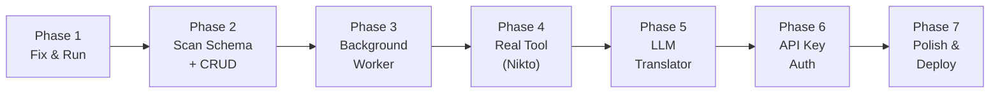

# SecureScope — Build & Learn Roadmap

> **Philosophy:** Each phase ends with something you can **test in Postman/curl**. You never write code you don't understand. We code together — I explain the *why* before the *what*.

---

## The 7 Phases



---

## Phase 1 — "Make What You Have Actually Work"

### Goal
Fix the bugs in your current code so you can **register a user, log in, and hit a protected route** — all tested via Postman or curl.

### What You'll Learn
- **Debugging imports** — Why missing `require()` statements crash your app at startup
- **Middleware ordering** — Why the order of `authenticate` and `validate` on a route matters
- **Error propagation** — How an error thrown in a service bubbles up through controller → error handler

### The Bugs to Fix (We'll Do These Together)

| File | Bug | Concept |
|---|---|---|
| `user.service.js` | Uses `AppError` but never imports it | A module is an island — it only knows what you explicitly `require()` |
| `user.routes.js` | Uses `registerSchema` / `loginSchema` but never imports them | Same concept — every variable must come from somewhere |
| `user.routes.js` | `authenticate` middleware on the `/login` route | Think about it: how can you check someone's token *before* they've logged in? |
| `user.routes.js` | Imports validate from `../middlewares/validate` but file is `validate.middleware.js` | File paths must be exact |
| `package.json` | Missing `cors`, `cookie-parser`, `jsonwebtoken` | You `require()` them in code but never installed them |

### How a Real Engineer Thinks About This
> *"Before I build anything new, I make sure what I have actually runs. The fastest way to lose hours is building on top of broken code. I start the server, read the error, fix it, repeat until I see `🚀 Server running`. Only then do I move forward."*

### Testable Result
```bash
# Start server — no crash
npm run dev
# → 🚀 SecureScope server running on http://localhost:3000

# Register
POST http://localhost:3000/api/users/register
Body: { "email": "test@startup.com", "password": "securepass123" }
# → 201 Created + cookie set

# Login
POST http://localhost:3000/api/users/login
Body: { "email": "test@startup.com", "password": "securepass123" }
# → 200 OK + cookie set

# Health check
GET http://localhost:3000/api/health
# → { "status": "ok" }
```

---

## Phase 2 — "The Scan Pipeline — Database Layer"

### Goal
Update the Prisma schema to match the blueprint (add `tool_type` to Scan, create the `Vulnerability` model), run a migration, and build the full Scan CRUD API.

### What You'll Learn
- **Database migrations** — Why you can't just edit the schema file and expect the DB to update itself
- **Enums in databases** — How `ToolType` (SEMGREP | NIKTO) works at the Postgres level
- **JSONB** — Why this column type is perfect for storing unpredictable scanner output
- **One-to-Many relations** — Scan → many Vulnerabilities. How foreign keys enforce data integrity
- **The 202 Accepted pattern** — Returning "I've queued your job" instead of waiting for scanner to finish

### Files to Create/Modify

| Action | File | What It Does |
|---|---|---|
| MODIFY | `prisma/schema.prisma` | Add `toolType` to Scan, create `Vulnerability` model |
| CREATE | `src/validators/scan.validator.js` | Zod schema: validate `url` and `tool_type` on incoming requests |
| REWRITE | `src/routes/scan.routes.js` | Wire up POST (create scan) and GET (fetch scan + results) |
| REWRITE | `src/controllers/scan.controller.js` | Handle HTTP, delegate to service |
| REWRITE | `src/services/scan.service.js` | Actual Prisma calls — create scan, fetch with vulnerabilities |
| MODIFY | `src/app.js` | Re-add the scan routes |

### How a Real Engineer Thinks About This
> *"I always build the database layer first. If my schema is wrong, everything on top of it breaks. I design the tables, think about the relationships, run the migration, then write a service that just does basic CRUD. I test it with Postman before moving on. The database is the foundation — get it right early."*

### Testable Result
```bash
# Create a scan (returns immediately, scan is queued)
POST http://localhost:3000/api/scans
Body: { "url": "https://example.com", "tool_type": "NIKTO" }
# → 202 Accepted { scan_id: "abc-123", status: "PENDING" }

# Check scan status (no results yet — worker hasn't run)
GET http://localhost:3000/api/scans/abc-123
# → { status: "PENDING", vulnerabilities: [] }
```

---

## Phase 3 — "The Background Worker (Fake Scanner)"

### Goal
Build a worker script that runs **separately from your Express server**, polls the database for `PENDING` scans, and processes them. But instead of running real tools, it uses **fake/dummy data**. This isolates the queuing concept from the tool complexity.

### What You'll Learn
- **Why background workers exist** — You can't make an HTTP request wait 2 minutes for a scan to finish
- **The polling pattern** — `setInterval` that checks the DB every few seconds for new work
- **Status state machines** — PENDING → IN_PROGRESS → COMPLETED/FAILED, and why each transition matters
- **`SELECT ... FOR UPDATE SKIP LOCKED`** — The Postgres trick that prevents two workers from picking up the same job
- **Running two processes** — Your server.js and your worker.js run side by side

### Files to Create

| Action | File | What It Does |
|---|---|---|
| CREATE | `src/workers/scanner.worker.js` | Polls DB, picks up pending scans, processes them with fake data |
| MODIFY | `package.json` | Add `"worker": "node src/workers/scanner.worker.js"` script |

### How a Real Engineer Thinks About This
> *"I never build the worker and the tool integration at the same time. First, I prove the queue works with fake data. Can I create a scan via the API, have the worker pick it up, change its status, and store dummy results? If yes, then I just swap the fake data for real tool output later. This is called 'stubbing' — and it saves you from debugging two things at once."*

### Testable Result
```bash
# Terminal 1: Start server
npm run dev

# Terminal 2: Start worker
npm run worker

# Terminal 1 (Postman): Create a scan
POST /api/scans → { "url": "https://example.com", "tool_type": "NIKTO" }

# Watch Terminal 2: Worker picks it up
# → "Processing scan abc-123..."
# → "Scan abc-123 completed. 3 fake vulnerabilities stored."

# Terminal 1 (Postman): Check results
GET /api/scans/abc-123
# → { status: "COMPLETED", vulnerabilities: [{raw_data: {...}, translated_text: null}] }
```

---

## Phase 4 — "Real Tool Integration — Nikto"

### Goal
Replace the fake scanner with an **actual Nikto scan**. Your worker will spawn Nikto as a child process, capture its output, and store the real results in the database.

### What You'll Learn
- **`child_process.spawn()`** — How Node.js runs external programs (Nikto, Python, etc.)
- **Streams (stdout / stderr)** — How output flows from the child process back to your Node code
- **Parsing tool output** — Nikto outputs CSV/JSON, you need to parse it into structured data
- **Error handling in async processes** — What happens when the scan tool crashes or times out
- **Timeouts** — Killing a scan that runs too long

### Files to Create/Modify

| Action | File | What It Does |
|---|---|---|
| CREATE | `src/scanners/nikto.scanner.js` | Wraps Nikto execution: spawn process, capture output, return parsed results |
| MODIFY | `src/workers/scanner.worker.js` | Import nikto scanner, call it instead of fake data |

### How a Real Engineer Thinks About This
> *"I build the scanner as a separate module that takes a URL in and returns results out. The worker doesn't know or care HOW the scan happens — it just calls `niktoScanner.run(url)` and gets data back. This separation means I can swap Nikto for any other tool later without changing the worker code. This is called the 'Strategy Pattern' — one of the most useful design patterns in backend engineering."*

### Testable Result
```bash
# Start worker, create a scan, wait ~30 seconds for Nikto to finish
GET /api/scans/abc-123
# → { status: "COMPLETED", vulnerabilities: [{raw_data: {actual nikto findings...}}] }
```

---

## Phase 5 — "The LLM Translator"

### Goal
After a scan completes and raw vulnerabilities are stored, send each finding to an LLM API and store the human-readable translation.

### What You'll Learn
- **External API calls from backend** — Using `fetch()` to call OpenAI/Gemini from your Node server
- **Prompt engineering basics** — How the prompt you write determines the quality of the translation
- **API key management** — Storing LLM API keys securely in `.env`
- **Cost awareness** — Estimating how much each scan costs in LLM API calls
- **Graceful degradation** — What if the LLM API is down? The raw data is still there, translation can retry later

### Files to Create

| Action | File | What It Does |
|---|---|---|
| CREATE | `src/services/llm.service.js` | Sends raw vulnerability data to LLM, returns translated text |
| MODIFY | `src/workers/scanner.worker.js` | After storing raw results, call LLM service, update `translated_text` |

### How a Real Engineer Thinks About This
> *"The LLM call is the most expensive and slowest part of the pipeline. I design it so that raw results are stored FIRST, and the translation happens AFTER. If the LLM call fails, I haven't lost the scan data. I can always retry the translation. Never let an optional step (translation) block a critical step (storing results)."*

### Testable Result
```bash
GET /api/scans/abc-123
# → {
#     status: "COMPLETED",
#     vulnerabilities: [{
#       raw_data: { ... nikto json ... },
#       translated_text: "Your server is running an outdated version of Apache..."
#     }]
#   }
```

---

## Phase 6 — "API Key Authentication"

### Goal
Add the ability for users to generate an API key, and authenticate future requests using that key instead of (or in addition to) JWT cookies.

### What You'll Learn
- **`crypto.randomBytes()`** — How to generate cryptographically secure random strings
- **Hashing vs Encryption** — Why you hash the API key (one-way) instead of encrypting it (two-way). Same principle as passwords.
- **Header-based auth** — Reading `X-API-Key` from request headers
- **Key prefixes** — Why real APIs use `sk_live_` prefixes (so you can identify a key type at a glance)

### Files to Create/Modify

| Action | File | What It Does |
|---|---|---|
| MODIFY | `prisma/schema.prisma` | Add `apiKeyHash` field to User |
| CREATE | `src/services/apikey.service.js` | Generate key, hash it, store hash, return raw key (once!) |
| CREATE | `src/middlewares/apikey.middleware.js` | Read `X-API-Key` header, hash it, look up user |
| MODIFY | `src/routes/scan.routes.js` | Protect scan routes with API key middleware |

### How a Real Engineer Thinks About This
> *"The raw API key is shown to the user exactly ONCE — at generation time. After that, I only store the hash. If someone asks 'what's my API key?', I can't tell them. They have to generate a new one. This is the same principle behind password hashing — if the database leaks, the attacker gets useless hashes, not working keys."*

### Testable Result
```bash
# Generate an API key (authenticated via JWT cookie)
POST /api/users/api-key
# → { key: "sk_live_a1b2c3d4e5f6..." }  ← shown ONCE

# Use the key to create a scan (no cookie needed)
POST /api/scans
Header: X-API-Key: sk_live_a1b2c3d4e5f6...
Body: { "url": "https://target.com", "tool_type": "NIKTO" }
# → 202 Accepted
```

---

## Phase 7 — "Polish & Deploy"

### Goal
Harden the application for real-world use and deploy it so people can actually use it.

### What You'll Learn
- **Rate limiting** — Prevent someone from spamming 1000 scans per minute
- **Input sanitization** — Making sure URLs are valid before scanning
- **Logging** — Structured logs so you can debug issues in production
- **Environment configuration** — Different settings for dev vs production
- **Deployment** — Getting your app on a real server (Railway, Render, or a VPS)

### Testable Result
**Your app is live on the internet.** A startup founder can register, get an API key, and scan their website.

---

## Summary — The Learning Stack

| Phase | You Build | You Learn |
|---|---|---|
| 1 | Working auth | Debugging, imports, middleware flow |
| 2 | Scan CRUD API | Prisma, migrations, JSONB, schema design |
| 3 | Background worker | Async processing, polling, status machines |
| 4 | Nikto integration | child_process, streams, strategy pattern |
| 5 | LLM translation | External APIs, prompt engineering, resilience |
| 6 | API key auth | Crypto, hashing, security principles |
| 7 | Production deploy | Rate limiting, logging, deployment |

> [!TIP]
> **Each phase is ~1-2 working sessions.** You'll have a deployable MVP after Phase 5. Phases 6-7 are the polish that makes it production-ready.

> [!IMPORTANT]
> **The rule:** We don't move to the next phase until you can explain what every line of code does in the current phase. No cargo-culting, no copy-pasting without understanding.
